# Phased Delivery Plan — Customer Parts Ordering Portal (Shopify + D365 FinOps)

| | |
|---|---|
| **Status** | Draft for review |
| **Version** | 0.1 |
| **Owner** | _[Solution Architect]_ |
| **Companion docs** | Solution Architecture Document (SAD); Technical Design Document (TDD) |
| **Last updated** | _[date]_ |

---

## 1. Purpose

This plan sequences delivery of the portal so the **majority of the build runs in parallel and ahead of a fully available D365 environment**. It classifies every component by environment dependency (buildable now / needs sandbox / needs production), defines the contracts to freeze first, and lays out phases and parallel workstreams.

## 2. Delivery principles

1. **Contract-first.** Freeze the integration contracts early (they're publicly documented or already known) so front-end and integration teams build against stable interfaces, not a live ERP.
2. **Parallelize aggressively.** Storefront, Azure integration, and D365 enablement are separate lanes that converge at integration phases.
3. **De-risk IVS and pricing/credit early.** These are the two contracts that are hard to mock faithfully. Get a sandbox in front of them before committing the design.
4. **BYOD is already available** — the catalog read path is not gated by D365 availability and can start immediately.
5. **Configuration over customization.** Favor standard APIs, entities, and business events; treat X++ customization as a gated exception.

---

## 3. Environment dependency classification

The central planning artifact: what can be built without D365, what needs a sandbox, and what needs production.

### 3.1 Buildable now — no live D365 required

| Component | Notes |
|---|---|
| Shopify storefront, theme, B2B companies/catalogs/price-list structure | Pure Shopify config + theme work |
| Checkout-validation extensions (availability/credit gates) | Built against mock middleware responses |
| Customer self-service & account pages | Shopify-native |
| Recurring-order (subscription) capability | Shopify subscription app/config |
| Azure scaffolding: Functions, Logic Apps, Service Bus, API Management, Key Vault | Infrastructure-as-code |
| Middleware orchestration, mapping, idempotency, saga/retry, dead-letter | Built against mocked IVS/OData |
| **Catalog sync from existing BYOD → Shopify** | **BYOD already populated — genuinely available now** |
| Middleware OpenAPI surface (Shopify-facing endpoints) | Contract definition + stubs |
| CI/CD, environments, observability scaffolding | DevOps lane |
| Mock/simulator services for IVS, OData, pricing/credit | Enables E2E dry-runs |

### 3.2 Needs a (non-production) sandbox — Tier-1 / dev D365

| Component | Why a sandbox is required |
|---|---|
| IVS configuration (data sources, dimension mappings, ATP formulas, soft-reservation feature) | Behavior must be validated, not assumed |
| Soft-reservation → physical-reservation conversion | The conversion semantics are subtle; verify end-to-end |
| Sales-order writeback against real OData entities | Validate header→lines linkage, master-data validation, number sequences |
| Pricing/credit service contract | Confirm effective-price and credit-status resolution |
| Business events (inventory threshold, price change, shipment/invoice) | Confirm availability and payloads |
| ATP forward-dating behavior (advance orders) | Validate future-period ATP |

### 3.3 Needs production (or production-like) D365

| Component | Why |
|---|---|
| Performance & throttling under real load | OData/Dataverse limits behave at scale only |
| UAT with real master data and pricing | Business sign-off |
| Final analytics link (Fabric/Synapse) | Production data |
| Cutover & go-live | — |

---

## 4. Contracts to freeze first (Phase 0 output)

These are the stable interfaces everything else builds against:

1. **IVS API contract** — query on-hand/ATP, reserve, allocation (request/response shapes).
2. **FinOps sales-order payload** — Sales order headers V2 / lines (key fields, linkage).
3. **Pricing/credit service contract** — effective price + credit status request/response.
4. **Middleware OpenAPI** — the endpoints Shopify's checkout extensions call.
5. **Order message schema** — the Service Bus order envelope (incl. reservation IDs, idempotency key).
6. **Status/fulfilment event schema** — FinOps → Shopify updates.
7. **BYOD catalog schema** — already known; document the subset used for sync.

Freezing these is the gate that unlocks parallel build.

---

## 5. Phases

```mermaid
gantt
    title Indicative phase sequencing (durations set once team size is known)
    dateFormat X
    axisFormat %s
    section Foundations
    Phase 0 — Discovery & contracts        :p0, 0, 1
    section Parallel build
    Phase 1 — Build against contracts/mocks :p1, 1, 3
    section Integration
    Phase 2 — Sandbox integration           :p2, 2, 4
    Phase 3 — Scenario hardening            :p3, 3, 5
    section Readiness
    Phase 4 — NFR / security / UAT          :p4, 4, 6
    Phase 5 — Pilot & cutover               :p5, 5, 7
    section Post
    Phase 6 — Tune & analytics              :p6, 6, 8
```

### Phase 0 — Discovery & contract freeze
- Resolve the SAD open questions (SCM/IVS licensing, pricing complexity, recurring-order model, advance-order policy, number-sequence ownership, multi-warehouse display, oversell budget, connector selection).
- Freeze the seven contracts (§4).
- Provision the Tier-1 sandbox; select connector.
- **Exit gate:** contracts signed off; sandbox available; key decisions logged.

### Phase 1 — Parallel build against contracts/mocks
- Storefront + B2B + checkout extensions.
- Azure integration scaffolding + middleware logic against mocks.
- Catalog sync against the **existing BYOD** (real data).
- Mock/simulator services stood up.
- **Exit gate:** storefront demoable on mock data; integration flows pass against simulators; catalog syncing from BYOD.

### Phase 2 — Sandbox integration
- Configure IVS in sandbox; wire live availability check + soft reservation.
- Validate sales-order writeback (header→lines) against real OData.
- Validate pricing/credit service contract.
- Replace mocks with sandbox endpoints flow-by-flow.
- **Exit gate:** end-to-end happy path works against sandbox (browse → reserve → order → status).

### Phase 3 — Scenario hardening
- Implement and test each scenario: backorder, advance/block (allocation), recurring, partial fulfilment, credit hold, price integrity, cancellations, returns, min-qty/UoM, kits, made-to-order, multi-warehouse.
- Tune sync cadence and availability buffers; exercise oversell remediation.
- **Exit gate:** all in-scope scenarios pass; oversell within budget on sandbox load.

### Phase 4 — NFR, security & UAT
- Performance/throttling tests; resilience (DLQ, saga, IVS-down fallback).
- Security review (auth, secrets, PCI boundary, least privilege).
- UAT with business users on production-like data.
- **Exit gate:** NFRs met; security signed off; UAT passed.

### Phase 5 — Pilot & cutover
- Soft launch to a limited customer/product set; monitor oversell, reservation leak, writeback health.
- Cutover plan, runbooks, rollback.
- **Exit gate:** pilot KPIs met; go-live approved.

### Phase 6 — Post-launch tuning & analytics
- Tune cadence/buffers against real oversell data.
- Stand up Fabric/Synapse Link analytics; retire any interim BYOD analytics use.
- **Exit gate:** steady-state operations; analytics live.

---

## 6. Parallel workstreams

| Lane | Owns | Peak phases |
|---|---|---|
| **Storefront** | Shopify config, B2B, theme, checkout extensions, subscriptions | 1–3 |
| **Integration** | Azure middleware, Service Bus, APIM, sync, saga/idempotency | 1–4 |
| **D365 / FinOps** | IVS config, OData/entities, business events, number sequences, pricing/credit service | 0, 2–4 |
| **Data / Analytics** | BYOD catalog sync, Fabric/Synapse Link | 1, 6 |
| **Cross-cutting / QA** | Mocks, CI/CD, observability, performance, security, UAT | 0–5 |

---

## 7. Critical path & dependencies

- **Critical path:** contract freeze (P0) → sandbox IVS + writeback validation (P2) → scenario hardening (P3) → UAT (P4) → cutover (P5).
- **Biggest schedule risk:** sandbox availability and IVS/pricing contract validation. If the sandbox slips, P2 slips and the critical path moves with it — hence pulling sandbox provisioning into P0.
- **Decoupled (low risk):** storefront and catalog-from-BYOD can complete largely independent of D365.

---

## 8. Indicative sizing

Relative effort by lane (T-shirt sizing; convert to a calendar once team composition is set):

| Lane | Size | Comment |
|---|---|---|
| Storefront | M | Mostly config; B2B pricing display is the nuance |
| Integration | L | The reservation/saga/writeback logic is the core build |
| D365 / FinOps | M | Largely configuration; small custom service only if pricing/credit needs it |
| Data / Analytics | S–M | Catalog sync small; analytics link modest |
| Cross-cutting / QA | M | Mocks + performance + security |

I can turn this into a dated timeline with named roles once you tell me the team size and whether the connector work is in-house or vendor.

---

## 9. Delivery-specific risks

| Risk | Mitigation |
|---|---|
| Sandbox delay blocks critical path | Provision in P0; build everything else against mocks meanwhile |
| Contract drift (mock ≠ reality) on IVS/pricing | Validate these two against sandbox before deep build; version contracts |
| Connector vs custom boundary unclear | Decide in P0; single inventory-write authority (IVS) |
| Scope creep across 13 scenarios | Phase scenarios by priority in P3; defer long-tail to fast-follow |
| Master data not ready in FinOps | Master sync precedes order sync; validate at checkout |
