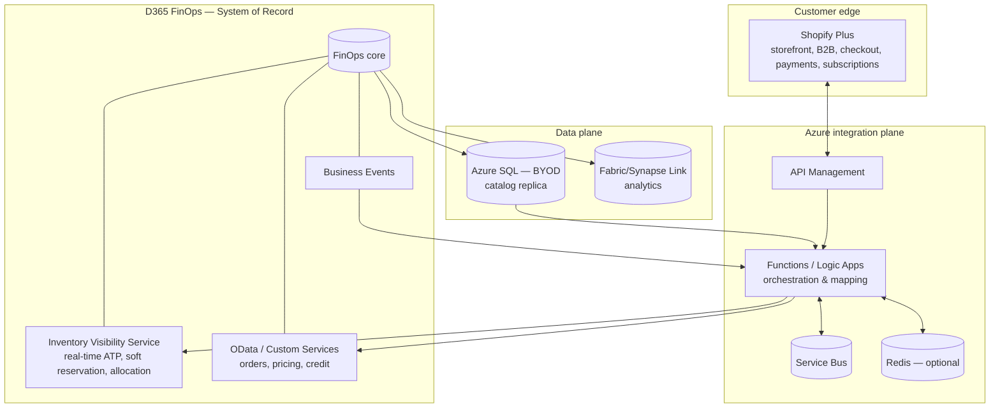
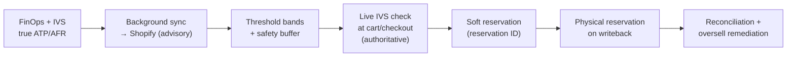

# Solution Architecture Document (SAD) — Customer Parts Ordering Portal

| | |
|---|---|
| **Status** | Draft for review |
| **Version** | 0.1 |
| **Owner** | _[Solution Architect]_ |
| **Companion docs** | Phased Delivery Plan; Technical Design Document (TDD) |
| **Audience** | Architecture review board, D365 leads, e-commerce & integration engineering, security, supply chain |
| **Last updated** | _[date]_ |

---

## 1. Introduction

### 1.1 Purpose
Defines the target solution architecture for a customer-facing **parts ordering portal** on **Shopify Plus**, integrated with **Dynamics 365 Finance & Operations (FinOps)** as system of record, an **Azure SQL (BYOD)** catalog serving layer, the **Inventory Visibility Service (IVS)** for real-time availability, and a **Fabric/Synapse Link** analytics tier. This document describes the *what* and *why*; implementation detail lives in the TDD.

### 1.2 Scope
**In scope:** storefront platform, integration topology, availability & reservation architecture, order lifecycle, data architecture, security, NFRs, architectural decisions.
**Out of scope:** visual design, payment-provider and tax-engine selection, detailed FinOps module configuration, data migration.

### 1.3 Definitions
**ATP** available-to-promise · **AFR** available-for-reservation · **IVS** Inventory Visibility Service · **BYOD** Bring-Your-Own-Database · **SoR** system of record · **DLQ** dead-letter queue.

### 1.4 References
Phased Delivery Plan; TDD; Microsoft Learn (Inventory Visibility, FinOps data entities, business events, Fabric Link).

---

## 2. Business context & drivers

A B2B customer base needs to self-serve parts ordering online. The catalog, pricing, inventory, customers, credit, and order fulfilment all live in FinOps today. The business wants a modern storefront without re-platforming the ERP, and — critically for parts — must **never confirm an order it cannot fulfil**.

**Primary drivers**
- Self-service ordering with B2B pricing and account structures.
- Trustworthy availability — no overselling.
- Straight-through order processing into FinOps (minimal manual handling).
- Support for backorders, recurring replenishment, and advance/reserved orders.
- Time-to-market — reuse Shopify's commerce engine rather than build one.

---

## 3. Architecture principles

| # | Principle | Implication |
|---|---|---|
| P1 | FinOps is the single system of record | All masters and orders reconcile to FinOps |
| P2 | Separate read path from write path | Browse from a replica; commit/validate against FinOps/IVS |
| P3 | The storefront stock figure is advisory; the live check is authoritative | Never commit on a synced number |
| P4 | Configuration over customization | Standard APIs/entities/events first; X++ only by exception |
| P5 | Decouple the customer experience from ERP availability | Queue-backed writeback; checkout never blocks on the ERP |
| P6 | Single authority for inventory reservation | IVS owns soft reservations across channels |
| P7 | Analytics is a separate plane | Fabric/Synapse Link only; never serves the storefront |

---

## 4. Solution overview

Shopify Plus provides the storefront and commerce engine. An Azure integration layer mediates all traffic between Shopify and FinOps. The catalog is served from the BYOD replica; **availability and reservations are handled in real time by IVS**; orders are written back to FinOps asynchronously and idempotently. Analytics flows from FinOps to the lake via Fabric/Synapse Link.

The defining architectural choice is the **availability and reservation model** (§8): rather than chasing a perfectly-live stock number in Shopify, the design uses a real-time IVS check plus soft reservations at the point of commit, backed by layered staleness controls.

---

## 5. Logical & container architecture

### 5.1 Container view

### 5.2 Component responsibilities

| Component | Responsibility | SoR? |
|---|---|---|
| Shopify Plus | Storefront, cart, checkout, payments, B2B, subscriptions | No |
| API Management | Secure ingress/egress, auth, rate policy, logging | No |
| Functions / Logic Apps | Orchestration, mapping, sync, availability/reservation/order flows | No |
| Service Bus | Durable decoupling, retry, DLQ | No |
| Redis (optional) | Short-TTL price/availability cache | No |
| IVS | Real-time ATP, soft reservation, channel allocation | Inventory availability |
| OData / Custom Services | Order create, live price/credit | No (proxy to SoR) |
| Business Events | Change notifications | No |
| BYOD (Azure SQL) | Catalog read replica | No (replica) |
| FinOps core | Products, pricing, inventory, customers, credit, orders | **Yes** |
| Fabric/Synapse Link | Analytics | No |

---

## 6. Integration architecture

### 6.1 Logical flows

| # | Flow | Direction | Pattern |
|---|---|---|---|
| 1 | Catalog sync | FinOps → BYOD → Shopify | Scheduled + event delta |
| 2 | Price (display + live resolve) | FinOps → Shopify; live at checkout | Delta + synchronous |
| 3 | Inventory/ATP sync | FinOps → IVS → Shopify | Frequent delta + event |
| 4 | Live availability check | Shopify → IVS | Synchronous |
| 5 | Soft → physical reservation | Shopify → IVS → FinOps | Sync + async |
| 6 | Order writeback | Shopify → Service Bus → FinOps | Async, idempotent |
| 7 | Order/fulfilment/status | FinOps → Shopify | Event |
| 8 | Customer master | Bidirectional | Event/delta |
| 9 | Returns/credit | Shopify → FinOps | Async |
| 10 | Analytics | FinOps → Fabric/Synapse | Managed link |

### 6.2 Patterns
- **Read/write separation** (P2): browse never hits FinOps.
- **Authoritative real-time check** (P3): IVS at cart/checkout.
- **Queue-backed writeback** (P5): Service Bus between checkout and FinOps.
- **Idempotency & saga**: every reservation/order carries an idempotency key; post-payment failures compensate.
- **Hybrid connector**: packaged connector for standard sync; custom middleware for availability/reservation.

---

## 7. Data architecture

| Domain | System of record | Serving / replica | Notes |
|---|---|---|---|
| Product/catalog | FinOps | BYOD → Shopify | BYOD is read-only replica |
| Pricing | FinOps | Shopify (display) + live resolve | Effective price resolved live for complex B2B pricing |
| Inventory/availability | FinOps (physical); IVS (ATP/AFR) | Shopify (advisory band) | IVS authoritative for ATP |
| Customer/account | FinOps | Shopify | Master must exist in FinOps before orders |
| Orders | FinOps | Shopify (status mirror) | Written back via OData |
| Analytics | FinOps | Fabric/Synapse Link | Never serves storefront |

**Mastering rule:** master data (customer, item) must exist in FinOps before an order can be created — so master sync precedes order sync. **Analytics separation:** BYOD feeds the *storefront*; Fabric/Synapse Link feeds *analytics* — the two are never crossed.

---

## 8. Availability & reservation architecture

The architectural heart. The portal must not commit to stock it doesn't have, despite inherent staleness between an external storefront and the ERP. The solution is **layered defense centered on IVS**, not a perfectly-live Shopify number.

**Why IVS:** it is real-time, effectively non-throttled (cache-served queries), supports **soft reservations** that convert to physical reservations when the order reaches FinOps (preventing double consumption across channels), and supports **forward-dated ATP** and **allocation** (ring-fencing) — the exact primitives the scenarios need.

**Architectural rules:**
- Sync **ATP/AFR, never raw on-hand**.
- Display **bands + buffer**, not exact counts.
- The **checkout gate** is the commitment point: live IVS check + soft reservation + live price/credit resolution before payment capture.
- Reservations have a **TTL**; abandoned carts release stock.
- Define an explicit **oversell budget per item class** and monitor it.

Scenario architecture (detailed designs in the TDD): **backorder** (order against future supply), **advance/block** (IVS allocation ring-fences stock; reduces everyone's ATP), **recurring** (re-check availability and re-resolve price each run), plus partial fulfilment, credit hold, price integrity, cancellations, returns, min-qty/UoM, kits, made-to-order, multi-warehouse.

---

## 9. Security architecture

| Concern | Approach |
|---|---|
| Identity | Entra ID; OAuth client-credentials per integration flow; least privilege |
| Edge | All traffic via API Management; no direct FinOps exposure |
| Secrets | Azure Key Vault; no secrets in code/config |
| Data in transit | TLS throughout; no sensitive data in URL parameters |
| Payments | PCI scope contained within Shopify checkout boundary |
| Auditability | Correlation IDs end-to-end; request logging at APIM |

---

## 10. Non-functional requirements

| Category | Target / approach |
|---|---|
| Availability (browse) | Served from replica; resilient to ERP downtime |
| Availability (checkout) | IVS-backed; defined fallback if IVS unavailable (larger buffer or confirm-after-order) |
| Performance | Browse from BYOD/Shopify; availability from IVS cache; OData reserved for writes |
| Scalability | Stateless Functions; Service Bus buffering; IVS scales server-side |
| Throttling resilience | Queue-backed, controlled-concurrency writeback; backoff |
| Data freshness | Velocity-tiered sync; event push on threshold crossing |
| Recoverability | DLQ + replay; saga/compensation; idempotency |
| Observability | Correlation IDs; oversell-rate, reservation-leak, writeback-health, sync-lag metrics |

---

## 11. Architecture decisions (ADR summary)

| ID | Decision | Status | Rationale | Alternatives rejected |
|---|---|---|---|---|
| ADR-1 | ~~Shopify Plus storefront~~ → **custom web app** | **Superseded by DR-001** | (was: B2B features, fast TTM, no commerce build) — custom chosen for cost; see `04-Decision-Register.md` | Shopify Plus (cost), mid-tier/headless commerce (pivot option) |
| ADR-2 | BYOD as catalog read layer | Accepted | Protects FinOps; already populated | Live OData reads (throttling/latency) |
| ADR-3 | IVS as availability/reservation backbone | Accepted | Real-time, non-throttled, soft reservations | OData ATP (throttled), synced-only (oversell) |
| ADR-4 | Queue-backed async writeback | Accepted | Decouples checkout from ERP; retry/idempotency | Synchronous OData on checkout (fragile) |
| ADR-5 | Hybrid connector + custom middleware | Accepted | Connectors do sync; custom does reservation depth | Pure connector (insufficient), pure custom (slow) |
| ADR-6 | Fabric/Synapse Link for analytics | Accepted | Current MS path; BYOD de-emphasized for analytics | BYOD analytics (scalability), retired Export to Data Lake |
| ADR-7 | Live price resolution at checkout | Provisional | Complex B2B pricing fidelity | Replicated price lists only (mismatch risk) |

---

## 12. Assumptions, dependencies, constraints

**Assumptions:** SCM licensed (IVS included); BYOD populated with parts master; analytics via Fabric/Synapse Link; B2B pricing complex enough to warrant live resolution.
**Dependencies:** Tier-1 sandbox for IVS/pricing validation; connector selection; master-data readiness in FinOps.
**Constraints:** FinOps OData throttling; sales-order entities not built for high parallelism; reservation conversion semantics fixed by IVS.

---

## 13. Risks

| Risk | Impact | Mitigation |
|---|---|---|
| Overselling from staleness | Broken promises | IVS live check + soft reservation; ATP-not-on-hand; buffers; monitoring |
| IVS not licensed (Finance-only) | Core design breaks | Confirm SCM/IVS early; standalone IVS fallback |
| B2B price mismatch | Wrong commit | Live resolution + price lock/tolerance |
| Throttling on writeback | Delayed orders | Queue-backed, single-thread, backoff |
| Reservation leakage | False scarcity | TTL + release; leak monitoring |
| Dual inventory-write authority | Double consumption | IVS sole reservation authority |

---

## 14. Open questions

1. SCM/IVS licensed? If not, real-time availability approach?
2. Live checkout price resolution required (latency/complexity)?
3. Recurring orders: Shopify subscription vs FinOps blanket agreement?
4. Advance/block orders: which item classes; hold/expiry policy?
5. Sales-order number-sequence ownership?
6. Multi-warehouse: aggregate vs branch-specific availability?
7. Oversell budget per item class + monitoring SLA?
8. Connector selection and coexistence with custom reservation middleware?
