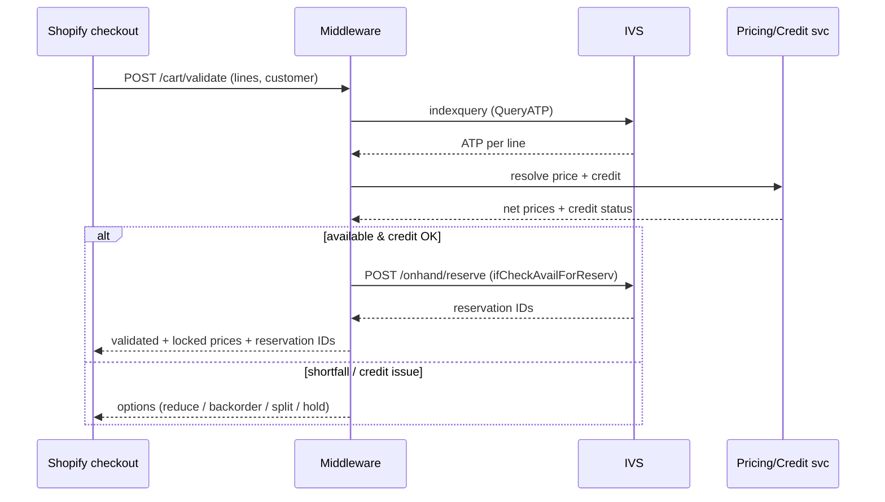
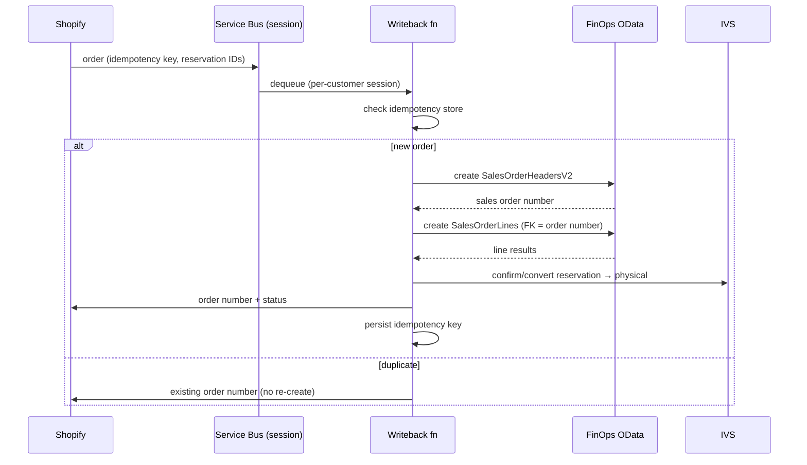
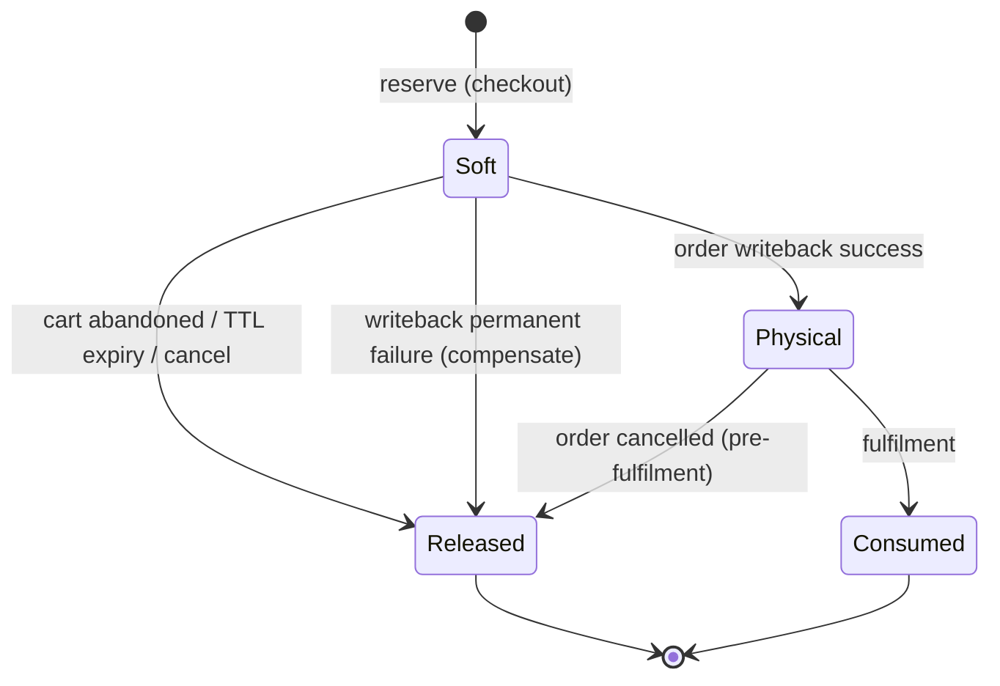

# Technical Design Document (TDD) — Customer Parts Ordering Portal

| | |
|---|---|
| **Status** | Draft for review |
| **Version** | 0.1 |
| **Owner** | _[Solution Architect / Integration Lead]_ |
| **Companion docs** | Solution Architecture Document (SAD); Phased Delivery Plan |
| **Audience** | Integration & e-commerce engineers, D365 developers/functional, QA |
| **Last updated** | _[date]_ |

> **Note on contracts.** Payloads below are representative and intended to be **validated against a Tier-1 sandbox in Phase 2** before being frozen. Field names follow Microsoft's documented shapes but must be confirmed against your environment version.

---

## 1. Introduction & relationship to SAD

This TDD implements the architecture defined in the SAD. It specifies component configuration, integration contracts, data mappings, detailed sequences, the reservation state machine, idempotency/saga mechanics, error handling, sync logic, and observability. Where the SAD says *what and why*, this says *how*.

---

## 2. System context (recap)

Shopify Plus → API Management → Azure Functions/Logic Apps (+ Service Bus, optional Redis) → FinOps (IVS for availability/reservation, OData/custom services for orders/pricing/credit, business events for change). BYOD feeds catalog; Fabric/Synapse Link feeds analytics. See SAD §5.

---

## 3. Component technical design

### 3.1 API Management
- One product/API per integration surface (storefront-facing, internal).
- OAuth2 client-credentials (Entra ID) validation; subscription keys per consumer.
- Rate-limit and spike-arrest policies; request/correlation-ID injection; centralized logging.

### 3.2 Azure Functions / Logic Apps
- **Availability function** (synchronous): validates cart against IVS, places soft reservations.
- **Pricing/credit function** (synchronous): calls FinOps custom service for effective price + credit status.
- **Writeback function** (queue-triggered): consumes order messages, creates sales order, converts reservation.
- **Sync functions** (timer + event): catalog, inventory/ATP, price, customer, status.
- **Reservation-release function** (timer): expires/releases stale soft reservations.

### 3.3 Service Bus topology
| Entity | Type | Purpose |
|---|---|---|
| `orders-inbound` | Queue | Shopify order → writeback |
| `orders-dlq` | DLQ | Poison/permanent-failure orders |
| `status-outbound` | Topic | FinOps status → Shopify (fan-out) |
| `reservation-release` | Queue | Scheduled reservation release |

- Sessions enabled on `orders-inbound` keyed by customer/site to enforce **controlled concurrency** on writeback (protects sales-order entities from parallelism).
- Max delivery count + exponential backoff; auto-forward poison to DLQ.

### 3.4 Redis (optional)
- Short-TTL cache (seconds–minutes) of resolved price and last-known ATP band to absorb bursts; never authoritative.

---

## 4. Integration contracts

### 4.1 IVS — availability query (representative)
`POST /api/environment/{environmentId}/onhand/indexquery` (with `QueryATP=true`)

```json
{
  "filters": {
    "organizationId": ["usmf"],
    "productId": ["PART-001","PART-002"],
    "siteId": ["1"],
    "locationId": ["11","12"]
  },
  "groupByValues": ["siteId"],
  "returnNegative": true,
  "QueryATP": true
}
```
Response yields available + ATP per product/dimension. **Use ATP/AFR, not raw on-hand**, to drive availability.

### 4.2 IVS — soft reservation (representative)
`POST /api/environment/{environmentId}/onhand/reserve`

```json
{
  "organizationId": "usmf",
  "productId": "PART-001",
  "quantity": 2,
  "dimensions": { "siteId": "1", "locationId": "11" },
  "ifCheckAvailForReserv": true
}
```
- `ifCheckAvailForReserv=true` → IVS validates AFR before reserving.
- Success returns a **reservation ID** (carried with the order and converted to a physical reservation on writeback).
- Release via the reservation API on cancel/expiry.

### 4.3 IVS — allocation (advance/block orders)
Channel/customer-group/location **allocation** ring-fences on-hand into a protected pool; consumption draws from the pool and reduces AFR for everyone else. Used for advance/reserved orders (§6.4).

### 4.4 FinOps — sales order writeback (OData)
Two entities, **header first then lines**, linked by sales order number:
- `SalesOrderHeadersV2` — customer account, order-taker, currency, site/warehouse defaults, requested dates, **idempotency reference** (custom field or de-dup table).
- `SalesOrderLines` — sales order number (FK), item number, quantity, unit, price (locked), site/warehouse, requested ship date, backorder flag, reservation reference.

### 4.5 Pricing/credit custom service (representative)
`POST /api/services/PortalPricing/resolve`
```json
{
  "customerAccount": "C-1001",
  "currency": "NZD",
  "lines": [{ "itemNumber": "PART-001", "quantity": 2, "site": "1" }],
  "date": "2026-06-24"
}
```
Returns net effective price per line (trade agreements/contract pricing applied) + customer credit status/available credit. Implemented as a custom service only if standard pricing APIs can't resolve effective price cleanly.

### 4.6 Middleware OpenAPI (Shopify-facing)
| Endpoint | Method | Purpose |
|---|---|---|
| `/cart/validate` | POST | Live ATP check + price/credit for cart |
| `/cart/reserve` | POST | Place soft reservation(s), return IDs |
| `/cart/release` | POST | Release reservation(s) |
| `/order` | POST | Accept placed order → enqueue writeback |
| `/order/{id}/status` | GET | Order/fulfilment status |

### 4.7 Business events consumed
Inventory threshold crossing, price change, shipment confirmed, invoice posted, order status change → drive event-based sync (flows 3, 2, 7).

---

## 5. Data mappings (field-level, representative)

### 5.1 Product (FinOps/BYOD → Shopify)
| Source (BYOD) | Shopify | Notes |
|---|---|---|
| ItemNumber | SKU | Key |
| ProductName | Title | |
| ProductDescription | Body HTML | |
| RetailCategory | Product type/collection | |
| BaseUnit | Unit metafield | UoM |
| OrderMultiple / MinOrderQty | Metafields | Cart validation (§6.8) |
| Backorderable flag | Metafield | Drives Backorder band |
| Lifecycle state | Status (active/archived) | Delist on discontinue |

### 5.2 Inventory/ATP (FinOps → IVS → Shopify)
| Source | Shopify | Notes |
|---|---|---|
| IVS ATP/AFR per site | Inventory level + band metafield | **ATP, not on-hand** |
| Threshold config | Band (In stock/Low/Backorder/MTO) | §7.2 |

### 5.3 Price (FinOps → Shopify; live at checkout)
| Source | Shopify | Notes |
|---|---|---|
| Price list (display) | Variant price / B2B catalog price | Advisory |
| Live effective price | Cart line price (locked) | Authoritative at checkout |

### 5.4 Customer (bidirectional)
| FinOps | Shopify | Notes |
|---|---|---|
| CustomerAccount | Company/customer metafield | Master in FinOps |
| Delivery addresses | Company locations | Must exist before order |
| Credit status | (not displayed) | Used at checkout gate |

### 5.5 Order (Shopify → FinOps) / Status (FinOps → Shopify)
| Shopify | FinOps | Notes |
|---|---|---|
| Order ID | Idempotency reference | De-dup |
| Customer | CustomerAccount | Must pre-exist |
| Line item SKU/qty/price | Line item/qty/locked price | Header→lines |
| Reservation IDs | Reservation reference | Convert soft→physical |
| — | Sales order number | Returned, mirrored to Shopify |
| Fulfilment/shipment/tracking | Pack/ship/invoice events | Supports partial (§6.5) |

---

## 6. Detailed sequence designs

### 6.1 Live availability check + soft reservation (checkout gate)


### 6.2 Order writeback + reservation conversion


### 6.3 Status / fulfilment sync (incl. partial)
Business events (pack/ship/invoice) → `status-outbound` topic → Shopify fulfilments. One FinOps order may emit **multiple shipments**; map each to a Shopify fulfilment with its own tracking; reflect remaining backorder.

### 6.4 Advance / block (allocation)
Customer reserves future quantity → middleware creates an **IVS allocation** (ring-fence) and/or forward-dated reservation → AFR drops for other channels → held quantity shown in account → expiry/release returns it to AFR. Distinct from backorder (claims stock now for later vs promises future supply).

### 6.5 Backorder
ATP ≤ 0 and item backorderable → line accepted, flagged backordered, promised date from forward ATP / inbound supply → FinOps order carries backordered line → fulfil (possibly partial) when supply lands → status syncs back. Do **not** soft-reserve against zero current on-hand; reserve against scheduled inbound where supported.

### 6.6 Recurring orders
Each recurrence (Shopify subscription **or** FinOps blanket-agreement release) re-enters at `/cart/validate` → **re-checks availability and re-resolves price** → writeback as normal. Per-recurrence failure policy configurable (backorder / skip / notify).

---

## 7. Reservation lifecycle & availability logic

### 7.1 Reservation state machine


### 7.2 Availability bands
| Band | Condition (ATP) | Behavior |
|---|---|---|
| In stock | ATP > buffer + threshold | Orderable |
| Low stock | 0 < ATP ≤ threshold | Orderable, limited |
| Backorder | ATP ≤ 0, backorderable | Orderable + promised date |
| Made to order | lead-time item | Orderable, show lead time |
| Unavailable | ATP ≤ 0, not backorderable / discontinued | Not orderable |

**Buffer formula (starting point):** `published_ATP = max(0, IVS_ATP − classBuffer)` where `classBuffer` is larger for A-class/fast movers. Tune against measured oversell rate.

### 7.3 Sync cadence (starting point — see Delivery Plan Appendix)
| Class | Background | Event push |
|---|---|---|
| A | 1–5 min | every change + threshold crossing |
| B | 10–15 min | threshold crossing |
| C | 30–60 min | threshold crossing |

---

## 8. Idempotency & saga design

- **Idempotency key:** Shopify order ID (+ a hash) on every order message and on the FinOps header (custom reference) and an idempotency store (table/Redis). Writeback checks the store before create.
- **De-dup on retry:** duplicate message → return existing sales order number, no re-create.
- **Saga / compensation (post-payment failure):**
  - *Transient* (timeout, throttle): retry with backoff; remain on `orders-inbound`.
  - *Permanent* (validation, master-data gap): release reservation, void/refund or route to CSR, dead-letter, notify.
- **Reservation linkage:** reservation IDs travel with the order so the physical reservation matches the promise.

---

## 9. Error handling & retry policy

| Class | Examples | Handling |
|---|---|---|
| Transient | OData throttling (429), timeout, IVS Dataverse limit | Exponential backoff + jitter; bounded retries; stay queued |
| Validation | Missing master data, invalid item/UoM, min-qty | Reject pre-payment at `/cart/validate`; post-payment → CSR + notify |
| Availability | ATP shortfall at writeback | Convert shortfall to backorder per policy; notify |
| Price | Mismatch vs locked price | Honor locked price within tolerance; above → CSR review |
| Credit | Over limit / on hold | Block or route to approval/draft order |
| Poison | Repeated permanent failure | DLQ + alert + manual remediation |

---

## 10. Configuration specifics (FinOps / IVS)

- **IVS:** register Entra app + secret; configure data source(s), dimension mappings, **ATP calculation formula(s)**, enable **soft-reservation** and **allocation** features; set partition rule (by location if multi-site).
- **Number sequences:** decide sales-order number ownership (FinOps-generated recommended) and configure.
- **Business events:** enable inventory threshold, price change, shipment, invoice, order status; route to Azure (Event Grid/Service Bus).
- **BYOD:** confirm catalog entity exports + refresh schedule feeding the serving layer.
- **Master data:** ensure customer/item/address present before order flows.

---

## 11. Observability

- **Correlation ID** propagated cart → reserve → order → fulfilment (APIM injects; carried on Service Bus).
- **Metrics/alerts:** oversell rate per class (vs budget), reservation leak (soft not converted/released), writeback DLQ depth, sync lag per tier, IVS/OData latency & 429 rate.
- **Dashboards:** order funnel health; reservation conversion; sync freshness.

---

## 12. Security implementation

- Entra ID client-credentials per flow; scopes least-privilege (e.g., separate principals for read-sync vs order-write).
- Secrets in Key Vault; rotation policy.
- APIM as sole ingress/egress; no direct FinOps/IVS exposure to the storefront.
- PCI scope confined to Shopify checkout; no card data traverses Azure/FinOps.
- No personal/sensitive data in URL parameters or logs (mask).

---

## 13. Test approach hooks (per Delivery Plan)

| Build | Mockable now | Needs sandbox |
|---|---|---|
| Storefront + checkout extensions | ✔ (mock `/cart/*`) | — |
| Middleware orchestration/saga/idempotency | ✔ (simulators) | — |
| Catalog sync | ✔ (existing BYOD) | — |
| IVS availability + reservation conversion | partial | ✔ behavior & ATP formula |
| Sales-order writeback (header→lines) | partial | ✔ entity validation, number seq |
| Pricing/credit resolution | partial | ✔ effective price/credit |
| Performance/throttling | — | ✔ (production-like) |

---

## 14. Open technical decisions

1. Number-sequence ownership (FinOps vs portal).
2. Reservation TTL value and release triggers.
3. Buffer values per item class (initial).
4. Pricing/credit: standard API vs custom service.
5. Multi-site partition rule and aggregate vs branch availability.
6. Connector boundary — which flows it owns vs custom middleware (single IVS reservation authority enforced).
